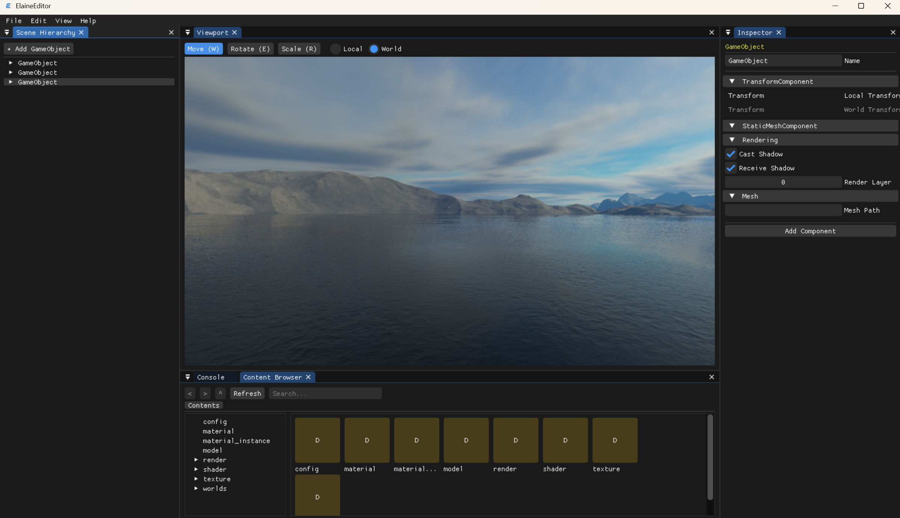

# Elaine Engine

-----------------


Welcome to the Elaine Engine source code!

You can build the Elaine Editor for Windows(Other platforms will be gradually opened in the future); compile Elaine Engine games for target platforms. Modify the code in any way you can imagine, and share your changes with others.



# Branch

-----------------------
The `master` is our Main Branch. For your own development,  you can run
```
git checkout -b <your-branch> origin/master
```

# Getting  and running

------------------------

The steps below take you through cloning your own private fork, then compiling and running the editor yourself:

Elaine Engine can be easily build by CMake. Make sure your CMake version is 3.26 or higher.

## Windows

1. Download Git on your computer and use the following commond:
   
   ```
   git clone --recursive https://github.com/Hppkk/ElaineEngine.git
   ```
   
   When updating existing repository, don't forget to update all submodules:
   
   ```
   git submodule update --init --recursive
   ```
   
2. Install Visual Studio 2022 or Visual Studio 2026. 

3. Run the batch file `setup_windows.bat`. That will generate the Visual Studio solution in the path `Build`. Open the `ElanieEngine.sln`with Visual Studio to run the project. Now you can start creating your own.

4. Choose one config between EditorDebug or EditorRelease  to debug your Editor.

5. Choose one config between RuntimeDebug or RuntimeRelease to debug your Game Client.

# Features

-----------------------------

1. The code in the Elaine Engine is written by C++20. 

2. Elaine Engine Core using the Vulkan and DX12 to rendering, you can see the source code in the core layer.

3. We use the [Geometric Tools](http://www.geometrictools.com/) for our math library.

# Contributions

---------------------------

We welcome contributions to Elaine Engine development through pull requests on GitHub.